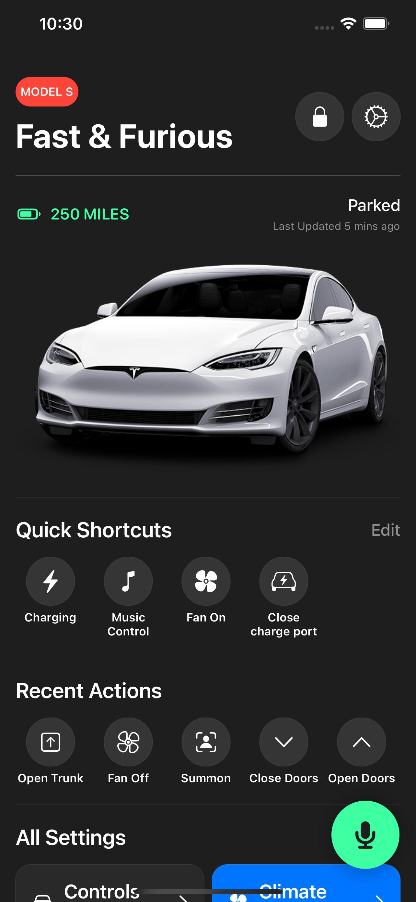
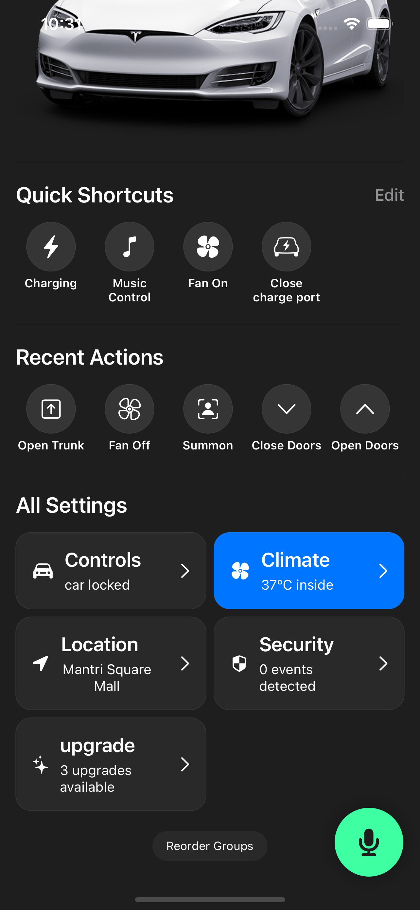
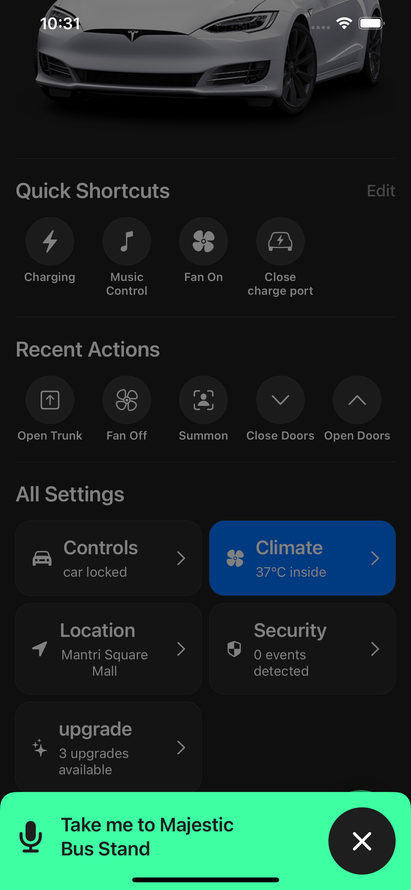
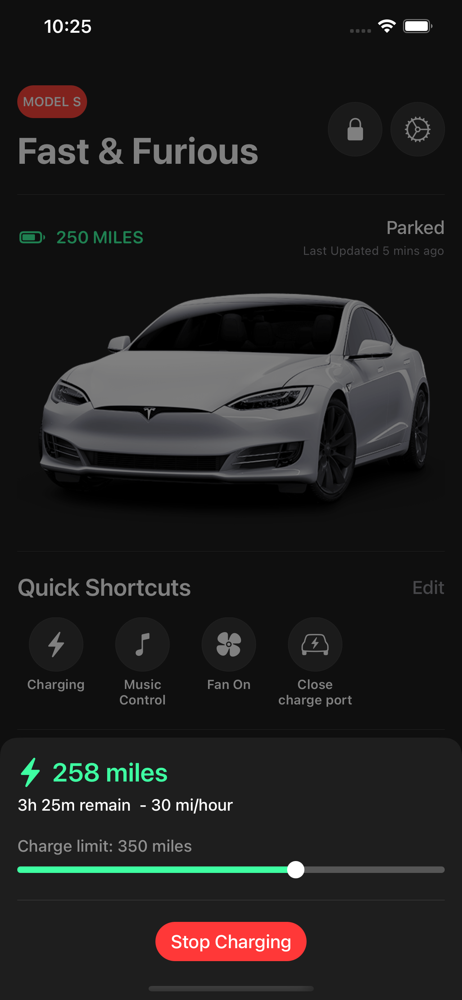
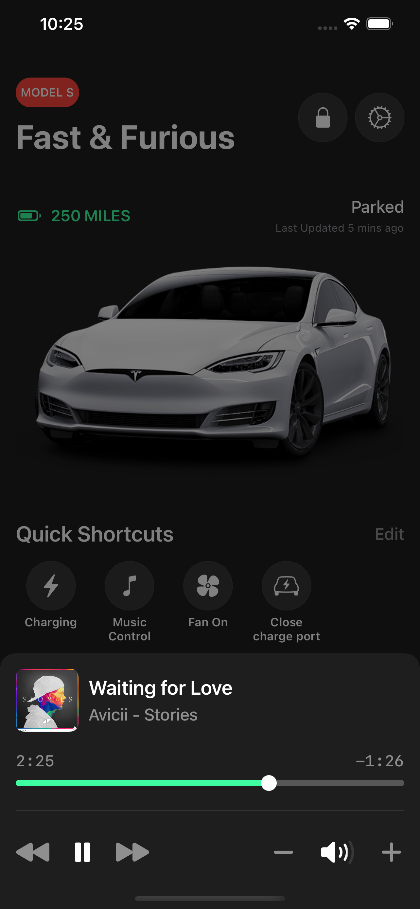
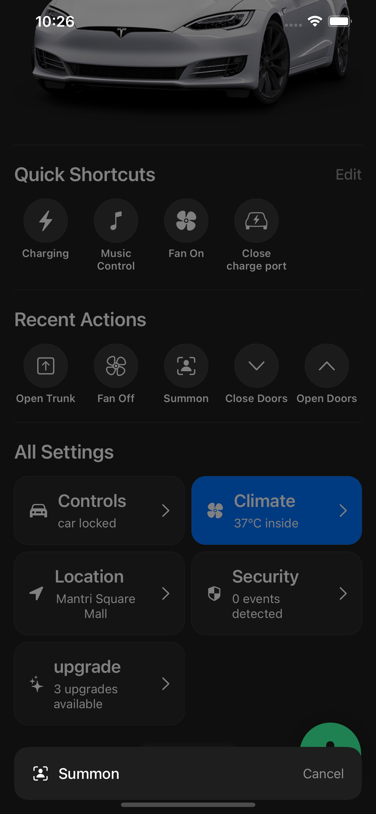
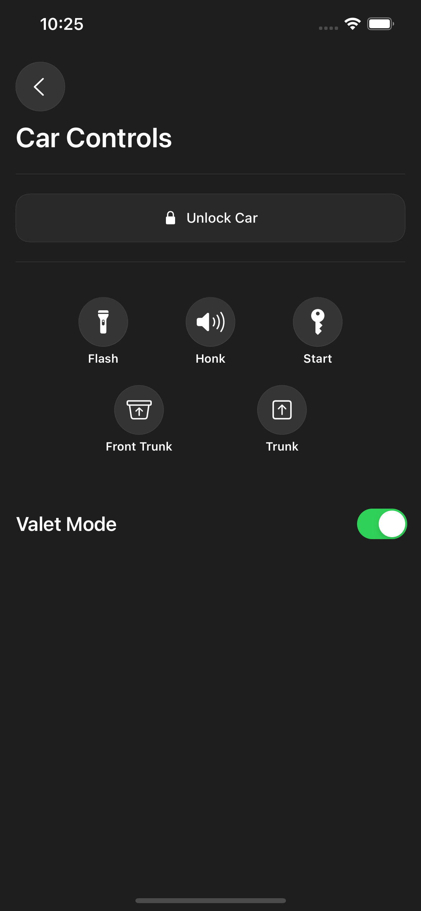
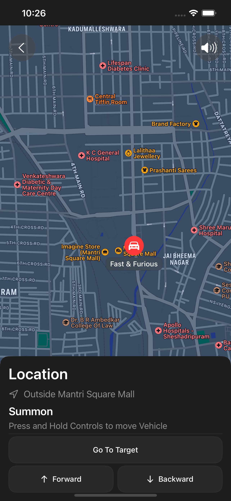

# MockUpTeslaApp
MockUp screens of Tesla Car App

     
  

## About the app
Click on "Honk" in Car Control Section for a surprise!

1. Language : Swift
2. Framework : SwiftUI
3. Pattern : MVVM
